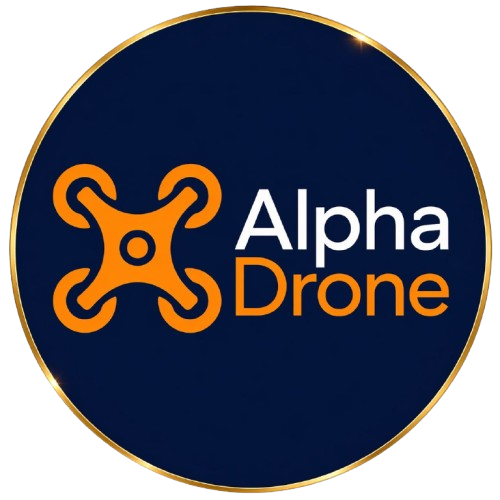

# 🚁 Alpha Drone — Landing Page

> Site de vendas de cursos de pilotagem de drones, desenvolvido com React + Vite + Tailwind CSS.



---

## 🛠️ Stack

| Tecnologia | Versão | Uso |
|---|---|---|
| [React](https://react.dev/) | 18+ | UI e componentização |
| [Vite](https://vitejs.dev/) | 8+ | Bundler e dev server |
| [Tailwind CSS](https://tailwindcss.com/) | 4+ | Estilização utilitária |
| [@tailwindcss/vite](https://tailwindcss.com/docs/installation/using-vite) | 4+ | Plugin Vite do Tailwind |

---

## 📁 Estrutura do Projeto

```
Curso-AlphaDrone/
├── public/
│   ├── AlphaDrone.png        # Logo principal
│   ├── Jhonathas.jpeg        # Foto instrutor
│   ├── Flavio.jpeg           # Foto instrutor
│   ├── Jhon.jpeg             # Foto instrutor
│   └── CertificadoDahua.jpeg # Certificação
├── src/
│   ├── components/
│   │   ├── Navbar.jsx        # Navegação fixa
│   │   ├── Hero.jsx          # Seção principal
│   │   ├── Stats.jsx         # Números de credibilidade
│   │   ├── Video.jsx         # Embed YouTube
│   │   ├── Cursos.jsx        # Cards dos cursos
│   │   ├── Modulos.jsx       # Conteúdo programático
│   │   ├── Instrutores.jsx   # Cards dos instrutores
│   │   └── Footer.jsx        # Rodapé
│   ├── App.jsx               # Componente raiz
│   ├── main.jsx              # Entry point
│   └── index.css             # Design system global
├── index.html
├── vite.config.js
└── package.json
```

---

## 🚀 Como rodar localmente

**Pré-requisitos:** Node.js 18+

```bash
# Clonar o repositório
git clone https://github.com/Devezaa7/Curso-AlphaDrone.git

# Entrar na pasta
cd Curso-AlphaDrone

# Instalar dependências
npm install

# Rodar em desenvolvimento
npm run dev
```

Acesse `http://localhost:5173` no navegador.

---

## 📦 Build para produção

```bash
npm run build
```

Os arquivos otimizados são gerados na pasta `dist/`.

---

## 🌐 Deploy

O projeto está configurado para deploy na **Vercel**.

1. Conecte o repositório na [Vercel](https://vercel.com)
2. Framework: **Vite**
3. Build command: `npm run build`
4. Output directory: `dist`

---

## 🎨 Design System

As cores e variáveis globais ficam em `src/index.css`:

```css
:root {
  --navy: #0d1b2e;        /* Fundo principal */
  --navy-light: #162440;  /* Fundo secundário */
  --orange: #e87d2b;      /* Cor de destaque */
  --orange-light: #f59240;
  --white: #ffffff;
  --gray: #a0aec0;
}
```

---

## 📋 Pendências

- [ ] Cadastrar produtos no Kiwify e atualizar links em `Cursos.jsx`
- [ ] Subir vídeo de apresentação no YouTube e atualizar ID em `Video.jsx`
- [ ] Conectar domínio `alphadrone.com.br` na Vercel
- [ ] Adicionar foto e dados do terceiro instrutor

---

## 👨‍💻 Desenvolvido por

**Deveza** — [@Devezaa7](https://github.com/Devezaa7)

---

*Alpha Drone © 2026 — Todos os direitos reservados.*